# 客餐厅吊顶
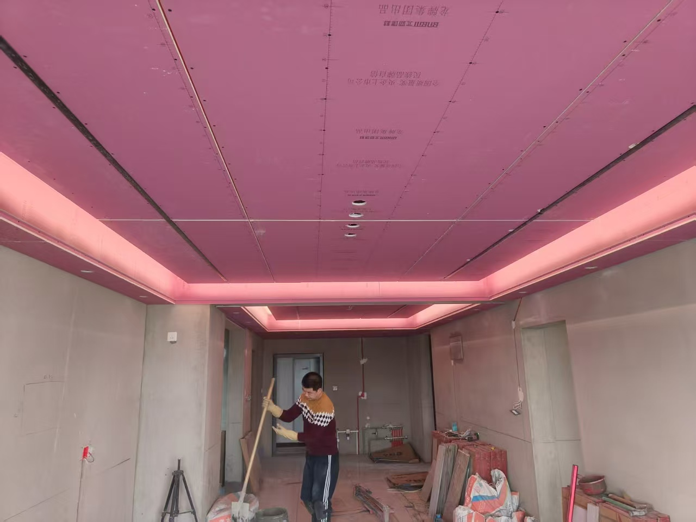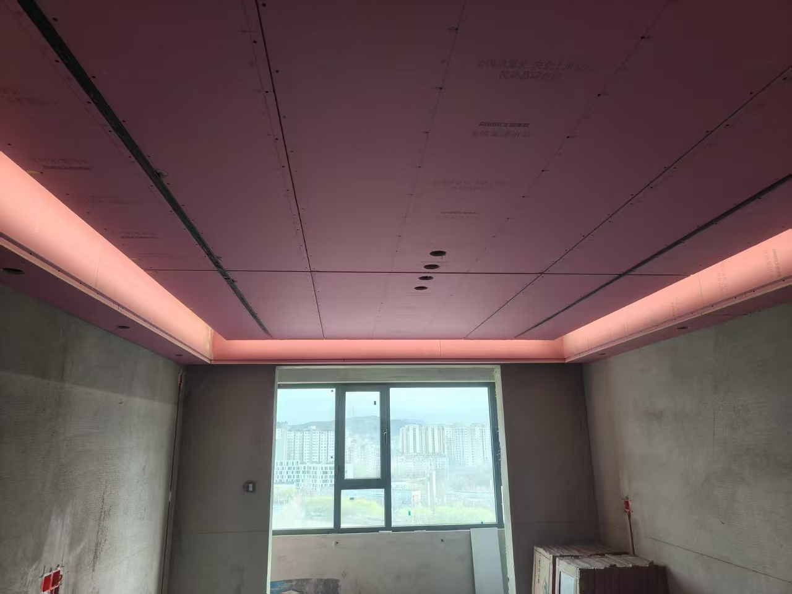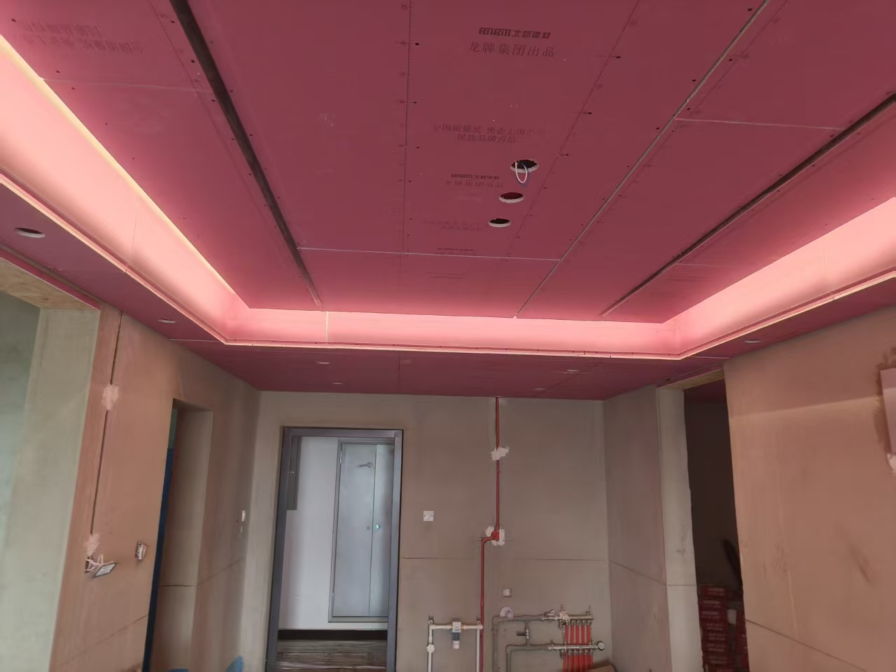
1. 要射灯和灯带
2. 有主灯和无主灯出两个版本
# 客厅沙发墙和电视墙和风管机
1. 沙发背景墙和电视背景墙不要刷太白，做点造型
2. 电视墙多做几种造型，把下面这两种做个效果图
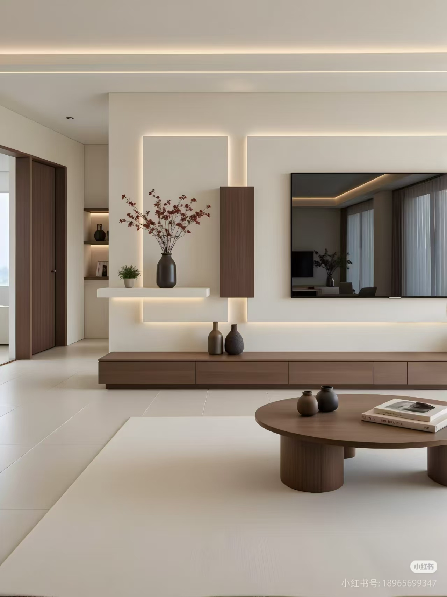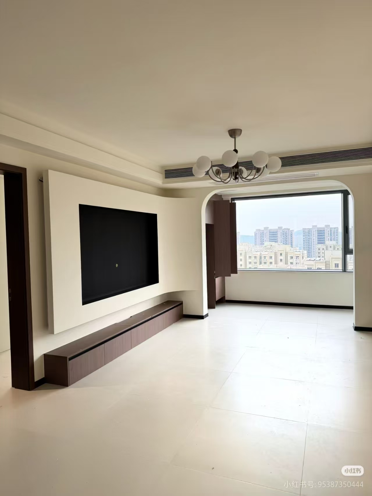
3. 客厅风管机要安装到阳台那边，阳台那里留出风口好看也实用
4. 三个卧室都换成空调挂机出个效果图
- 次卧放到学习桌吊柜上面
- 电竞室也放到吊柜上面，吊柜高度不直接屋顶了
- 主卧放到床头柜上面
# 包套
厨房门口和客卫门口出一个包套的效果图，有拐角的地方都包套，都像阳台那样的包套
阳台也出一个不包套的效果图，也就是：
效果图一：阳台不包、客卫包、厨房包
效果图二：阳台不包、客卫不包、厨房包

<strong>包套用和门相同颜色的包</strong>

# 卧室
>主卧
>>**做一个床头背景墙全墙的效果图**
>>侧边柜，不要床尾柜了
>次卧
>>床头向北，不要向西了
>>挨墙的那一侧做一个护墙板看看效果
# 鞋柜

 **做个这样的看看**
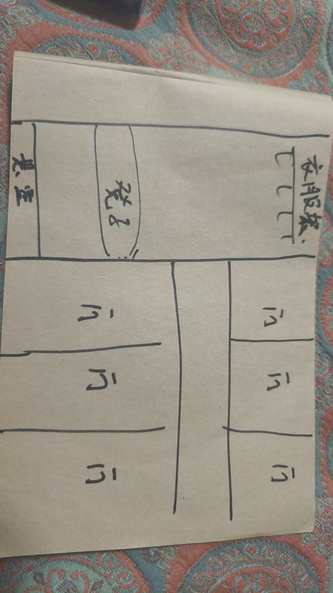
# 厕所
**可以试试这样的花砖，做好了会很好看，要是整体风格不搭就算了**
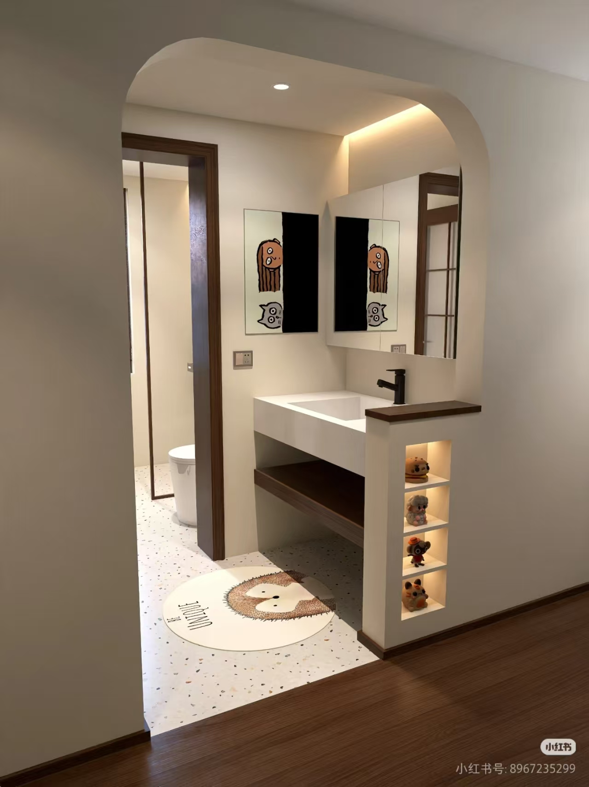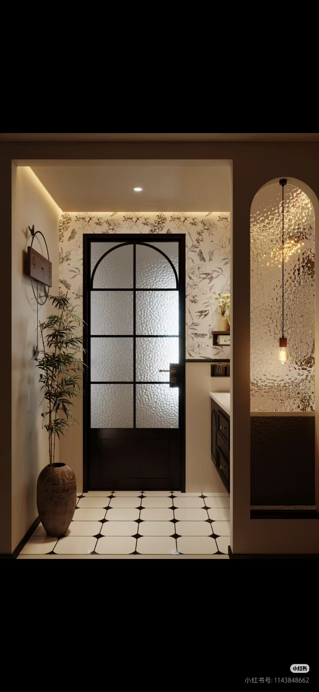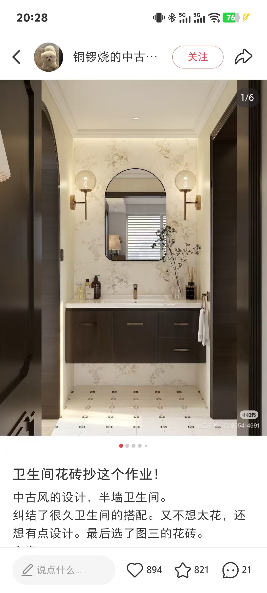
# 厨房
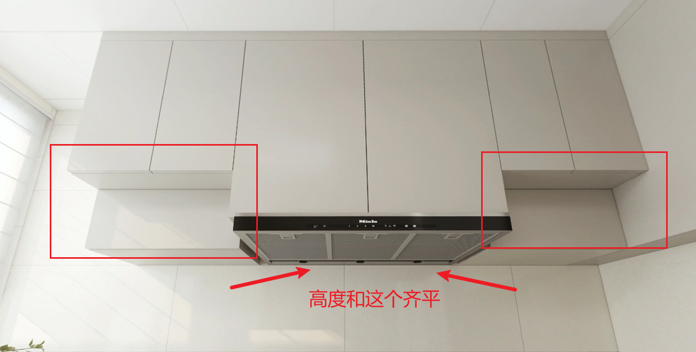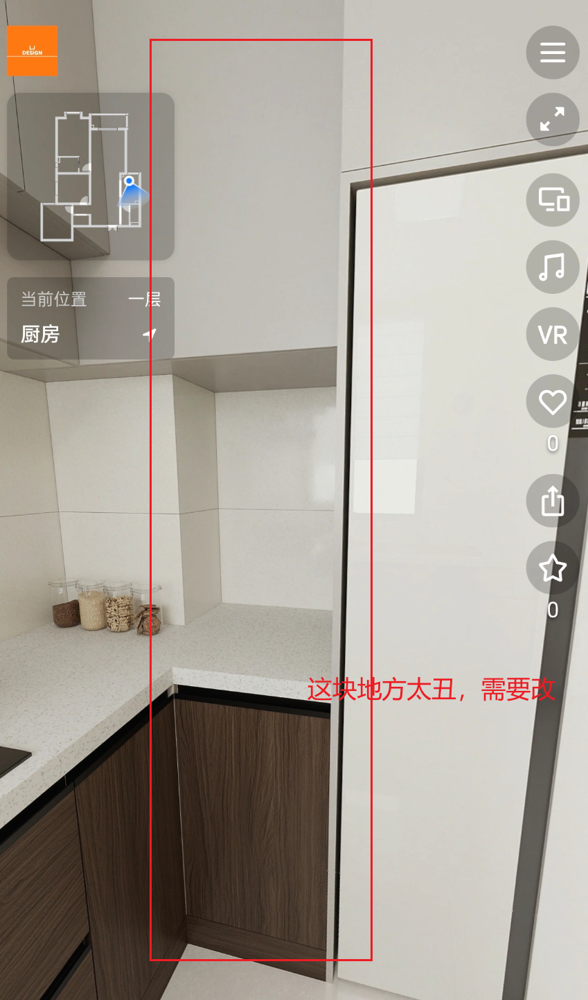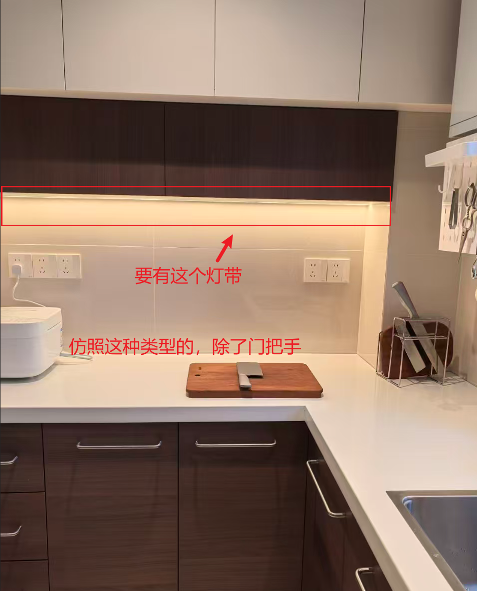